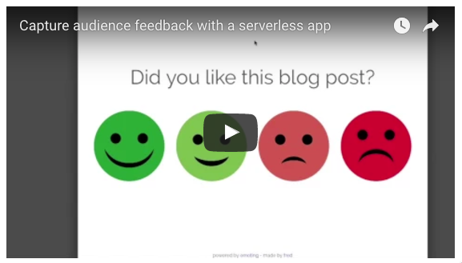
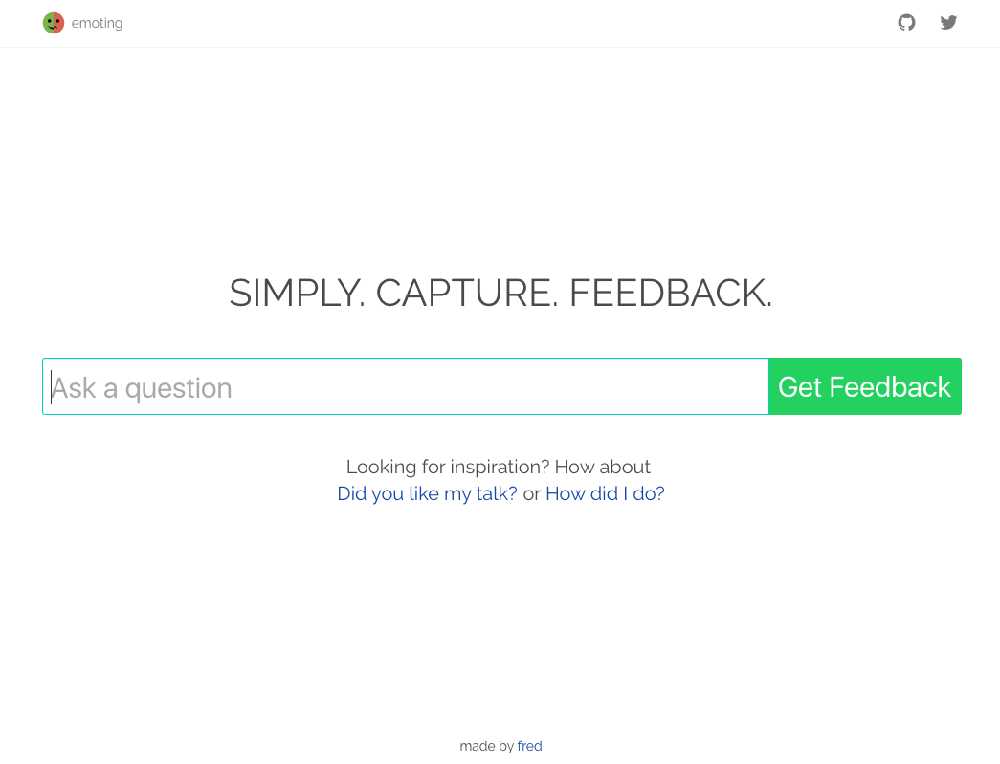
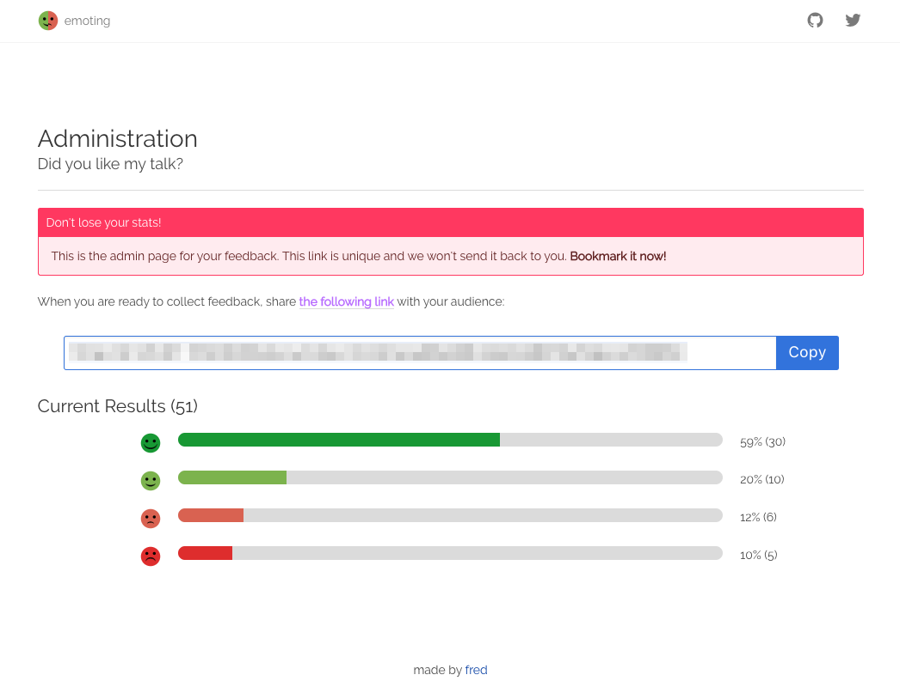
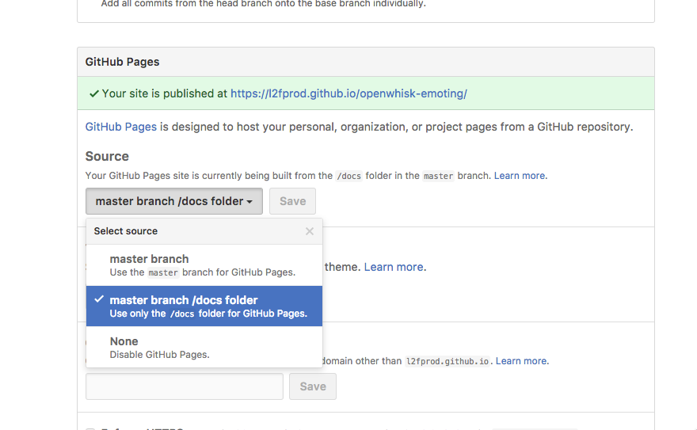

# Capture audience feedback with a serverless app

[](https://travis-ci.org/IBM-Cloud/openwhisk-emoting) [](https://coveralls.io/github/IBM-Cloud/openwhisk-emoting?branch=master)

You are giving this presentation and as attendees leave the room you'd like to get a quick feel about how you did. *Emoting* mimics the smiley terminals you may see at the airport security or whenever you are queueing somewhere.

   [](https://youtu.be/5btqydWZ8u0 "emoting")

## Overview



Built using the IBM Bluemix, the application uses:
* IBM Bluemix OpenWhisk to host the backend
* Cloudant to persist the data
* GitHub Pages to host the frontend

No runtime to deploy, no server to manage :)


<details>
<summary></summary>
architecture
  digraph G {
    node [fontname = "helvetica"];
    rankdir=LR;
    user -> github;
    github -> openwhisk [label="API Calls"];
    openwhisk -> cloudant;
    github [shape=circle style=filled color="%234E96DB" fontcolor=white label="GitHub Pages"];
    openwhisk [shape=circle style=filled color="%2324B643" fontcolor=white label="OpenWhisk"];
    cloudant [shape=circle style=filled color="%234E96DB" fontcolor=white label="Cloudant"];
  }
architecture
</details>

## Application Requirements

* IBM Bluemix account. [Sign up][bluemix_signup_url] for Bluemix, or use an existing account.

## Deploying OpenWhisk Emoting (almost) automatically in Bluemix

OpenWhisk Emoting comes with a toolchain you can use to deploy the solution with few clicks. If you want to deploy it manually, you can skip this section.

1. **Ensure your organization has enough quota for one service.**

1. Click ***Deploy to Bluemix*** to start the Bluemix DevOps wizard:

   [](https://console.bluemix.net/devops/setup/deploy/?repository=https%3A%2F%2Fgithub.com/IBM-Cloud/openwhisk-emoting&branch=master)

1. Select the **GitHub** box.

1. Decide whether you want to fork/clone the OpenWhisk Emoting repository.

1. If you decide to Clone, set a name for your GitHub repository.

1. Select the **Delivery Pipeline** box.

1. Select the organization and space where you want to deploy the app. Keep *US South* for the region as OpenWhisk is only available there today.

   > :warning: Make sure the organization and the space have no *space* in their names.

1. Click **Create**.

1. Select the Delivery Pipeline named **openwhisk-emoting**.

1. Wait for the Deploy job to complete.

1. When the job complete, look at its log and make note of the API Gateway endpoint where the OpenWhisk API has been deployed. You should see log statements like:

   ```
   ok: created API /emoting/1/questions PUT for action /_/emoting/questionCreate
   https://service.us.apiconnect.ibmcloud.com/gws/apigateway/api/abcdeff9d9300320200dhcdbcddc/emoting/1/questions
   ok: created API /emoting/1/questions GET for action /_/emoting/questionRead
   https://service.us.apiconnect.ibmcloud.com/gws/apigateway/api/abcdeff9d9300320200dhcdbcddc/emoting/1/questions
   ok: created API /emoting/1/stats GET for action /_/emoting/questionStats
   https://service.us.apiconnect.ibmcloud.com/gws/apigateway/api/abcdeff9d9300320200dhcdbcddc/emoting/1/stats
   ok: created API /emoting/1/ratings PUT for action /_/emoting/ratingCreate
   https://service.us.apiconnect.ibmcloud.com/gws/apigateway/api/abcdeff9d9300320200dhcdbcddc/emoting/1/ratings
   ```

   **https://service.us.apiconnect.ibmcloud.com/gws/apigateway/api/abcdeff9d9300320200dhcdbcddc/emoting/1** is the API Gateway endpoint in this example.

1. Checkout the code from your own openwhisk-emoting repository.

1. Edit `docs/js/emoting.js` and change the `apiUrl` value to your API base path.

1. Commit the `docs/js/emoting.js` file.

1. Enable GitHub Pages on your repo. When doing so, select the option to use the `docs` folder in the master branch.

   

## Deploying OpenWhisk Emoting manually in Bluemix

1. Clone or fork the repository https://github.com/IBM-Cloud/openwhisk-emoting

1. Checkout the code

1. Ensure your [OpenWhisk command line interface](https://console.ng.bluemix.net/openwhisk/cli) is property configured with:

   ```
   wsk list
   ```

   This shows the packages, actions, triggers and rules currently deployed in your OpenWhisk namespace.

1. Create a Cloudant service in IBM Bluemix

1. Copy the file named template-local.env into local.env

   ```
   cp template-local.env local.env
   ```

1. Get the Cloudant service credentials from the Bluemix dashbaord and replace placeholders in `local.env` with corresponding values (url, username and password). These properties will be injected into a package so that all actions can get access to the database.

1. Deploy the actions to OpenWhisk

   ```
   ./deploy.sh --install
   ```

1. Expose the OpenWhisk actions as REST endpoints

   ```
   ./deploy.sh --installApi
   ```

   You may need to use `wsk bluemix login` so that the `wsk` command line can create the API in Bluemix.

1. Make note of your API Gateway base path in the output. The base path looks like `https://service.us.apiconnect.ibmcloud.com/gws/apigateway/api/abcdeff9d9300320200dhcdbcddc/emoting/1`.

1. Edit `docs/js/emoting.js` and change the `apiUrl` value to your API base path.

1. Commit the `docs/js/emoting.js` file.

1. Enable GitHub Pages on your repo. When doing so, select the option to use the `docs` folder in the master branch.

   

## Running the app locally

1. Follow the previous steps to deploy the OpenWhisk actions.

1. Make sure to edit `docs/js/emoting.js`

1. Install dependencies

   ```
   npm install
   ```

1. Start the local web server

   ```
   npm start
   ```

1. Point your browser to http://127.0.0.1:8080

## Code Structure

| File | Description |
| ---- | ----------- |
|[**question.create.js**](actions/question.create.js)| Creates a new question. |
|[**question.read.js**](actions/question.read.js)| Returns the text of a question based on its ID. |
|[**question.stats.js**](actions/question.stats.js)| Returns results about a given question. |
|[**rating.create.js**](actions/rating.create.js)| Called when a user taps on one of the rating. |
|[**deploy.sh**](deploy.sh)|Helper script to install, uninstall, update the OpenWhisk actions used by the application.|

## License

See [License.txt](License.txt) for license information.

---

This project is a sample application created for the purpose of demonstrating a serverless app with OpenWhisk. The program is provided as-is with no warranties of any kind, express or implied.

[bluemix_signup_url]: https://console.ng.bluemix.net/?cm_mmc=GitHubReadMe
